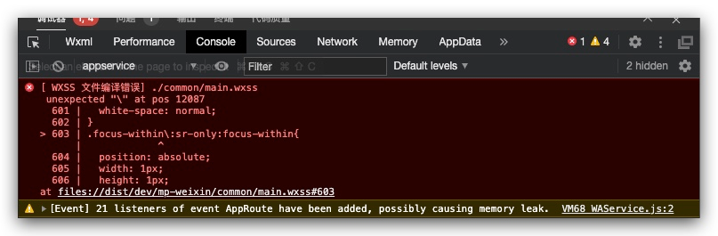

# miniapp-tailwindcss-plugin

能让uniapp支持tailwindcss的webpack插件

## TODO

- [ ] 支持在template外转换tailwindcss
- [x] template的转换从正则改为htmlparser2进行解析

## 这个插件为什么会出现

当我尝试在Uniapp小程序上引入tailwindcss的样式之后，重新编译发现控制台出现以下的问题：

